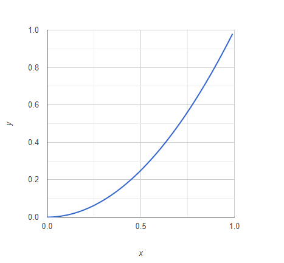
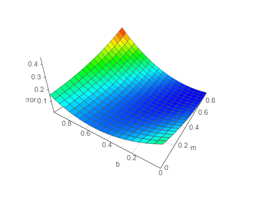

# Visualize gradient decsent in node.js

In this example you can visualize a gradient descent landscape of a polynomial function f(x) = a * x^exponent. You can adjust the parameters a and the exponent of the function by yourself and look how the gradient changes.

## About this repo

This repository contains the logic and scripts that combine
three packages:
- [visjs.org](http://visjs.org/) A libary to show 3dGraphs
- [Babeljs.io](https://babeljs.io/) An extention to use next generation JavaScript
- [Parcel Bundler](https://github.com/parcel-bundler/parcel) Blazing fast, zero configuration web application bundler
- [Google Charts](https://developers.google.com/chart/interactive/docs/quick_start) Display live data on your site
- [Bootstrap](https://getbootstrap.com/) Build responsive, mobile-first projects on the web with the world’s most popular front-end component library.

## Gallery

Visualisation of the function f(x) = a * x^exponent:

Visualisation of the gradient Landscape:

### Install

1. Download the project
2. Call 'npm install' in your projectfolder(Make sure npm is installed)
3. 'npm run build'
4. 'npm run watch'
5. If your browser doesn't open by itself navigate to 'http://localhost:1234/'

### Credits

Credits to [Ryan Harris](https://www.youtube.com/channel/UCRAmB5K-2GLvtaXcH9GCy-A)